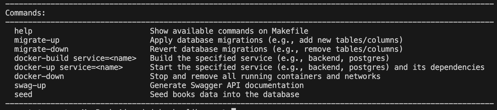
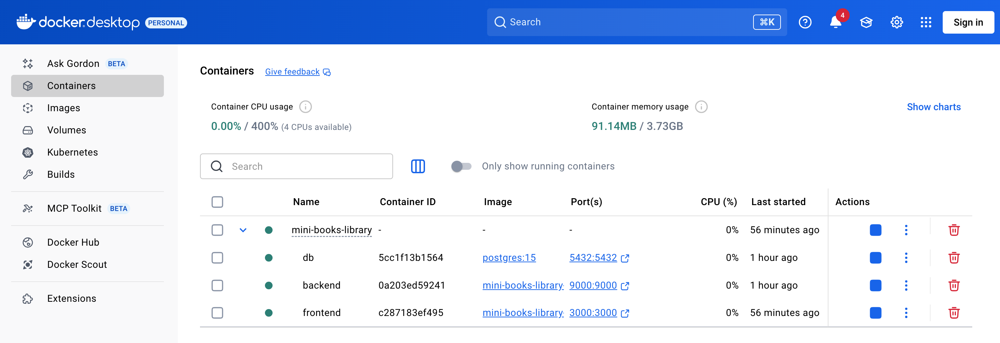
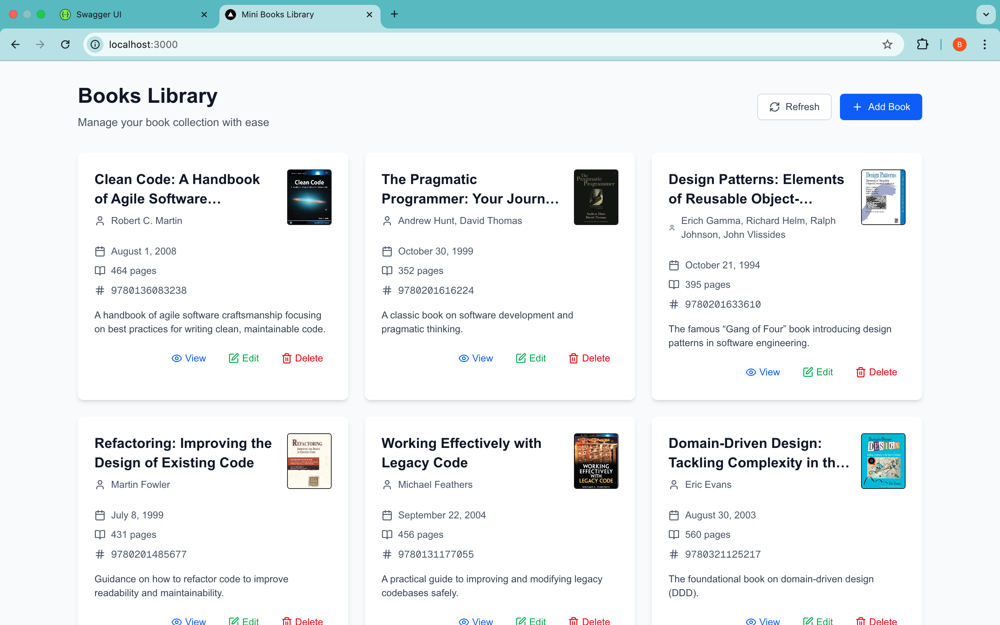
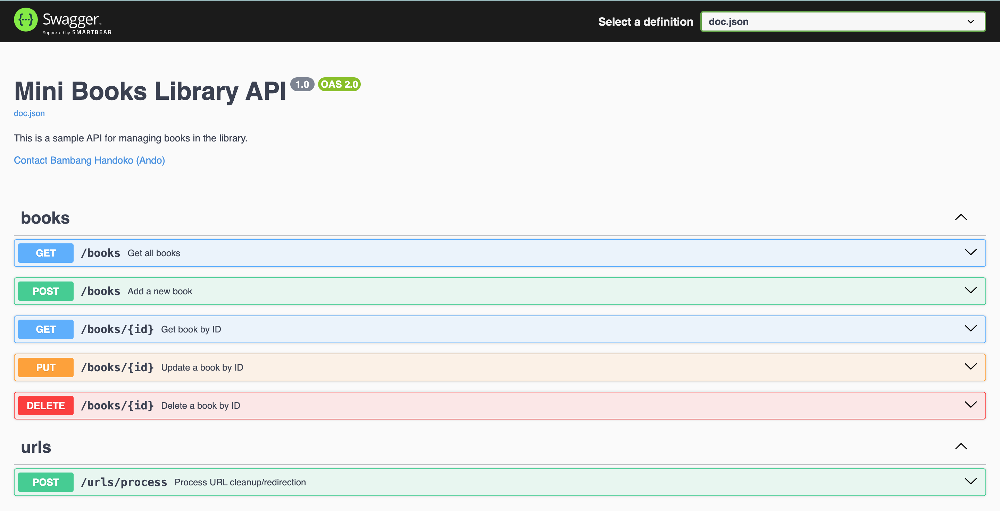
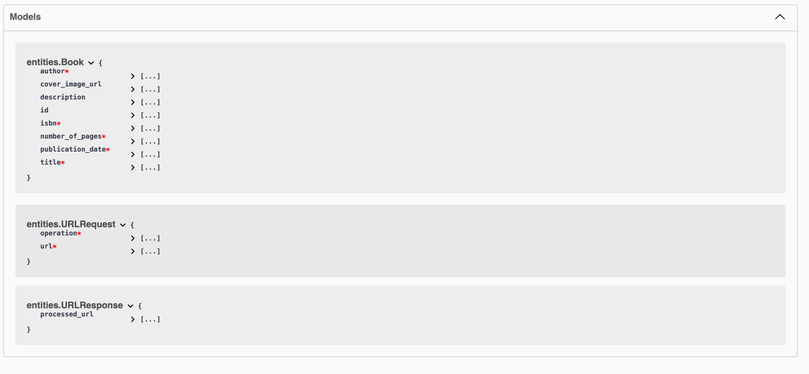
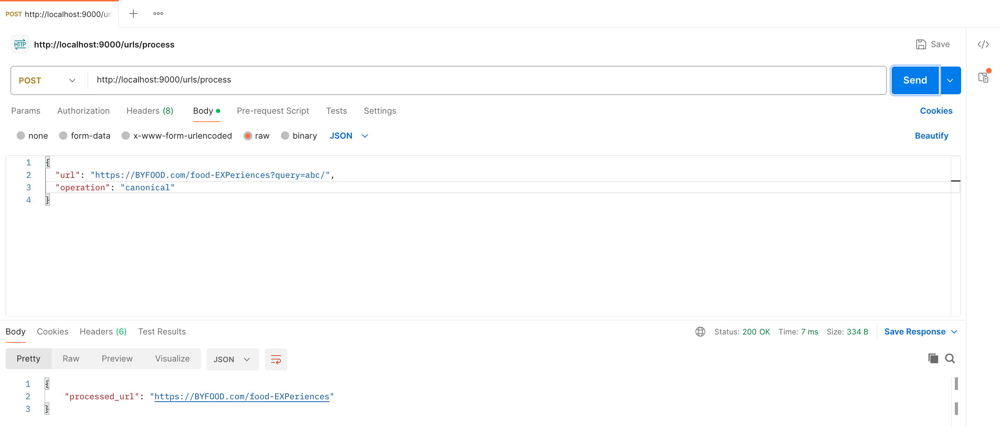
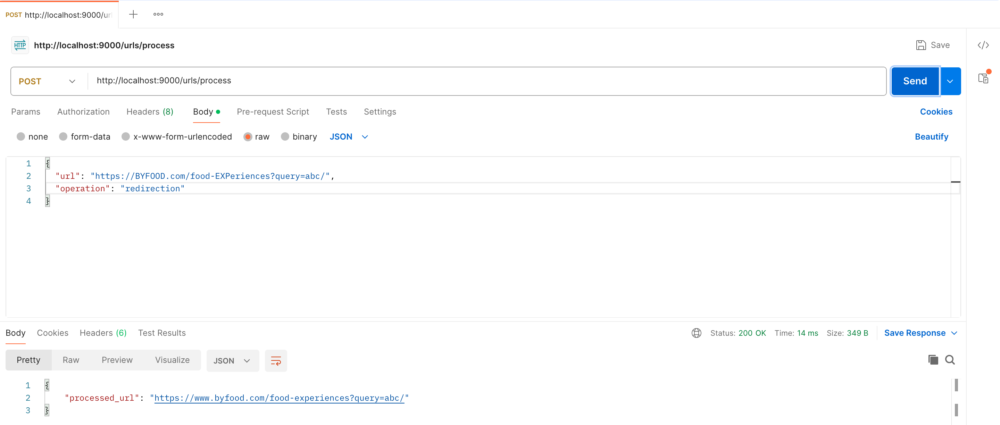
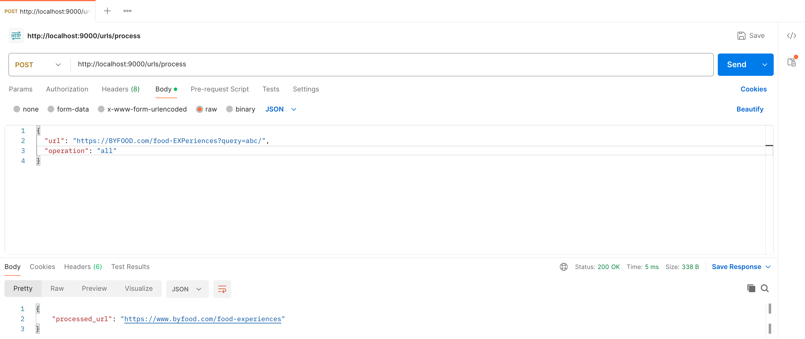

# Mini Books Library

> A small full-stack Next.js + TypeScript frontend and a Golang backend for managing a tiny book library (CRUD) — plus an URL cleanup / redirection service for assignment test purpose.

---

## Table of contents
- [Overview](#overview)
- [Project Structure](#project-layout)
  - [Frontend](#frontend)
  - [Backend](#backend)
- [Features](#features)
- [Prerequisites](#prerequisites)
- [Installation](#installation)
- [Make CLI](#make-cli)
- [Dockerization](#Dockerization)
- [Look! It Runs!!](#look--it-runs--)
- [API — endpoints & examples](#api---endpoints--examples)
  - [Books endpoints](#books-endpoints)
  - [URL cleanup & redirection endpoint](#url-cleanup--redirection-endpoint)
- [cURL examples](#curl-examples)
- [Data schema & ERD (books)](#data-schema--erd-books)
- [Swagger / API specification](#swagger--api-specification)
- [Running tests (BE & FE)](#running-tests-be--fe)
- [Design decisions & trade-offs](#design-decisions--trade-offs)
- [Future improvements](#future-improvements)
- [Contributing](#contributing)
- [Assumptions & TODO / what I couldn't auto-detect](#assumptions--todo--what-i-couldnt-auto-detect)

---
## Overview

This repository is a monorepo containing:

- `backend/` — Golang REST API implementing:
  - Books CRUD (`GET /books`, `POST /books`, `GET /books/:id`, `PUT /books/:id`, `DELETE /books/:id`)
  - URL cleanup & redirection POST endpoint (accepts `{ "url": "...", "operation": "redirection|canonical|all" }` and returns `{ "processed_url": "..." }`) per the assignment.
- `frontend/` — Next.js + TypeScript app that provides a dashboard and forms (add/edit/view/delete books).
- Top-level: `Makefile`, `docker-compose.yml` for local orchestration.


> The project assignment describes both the Books CRUD API and the URL-cleanup/redirection behavior and output format — I used that spec to craft the README examples. 

---

## Prerequisites

- Node.js (v18+ recommended) & npm (or yarn/pnpm) — for frontend.
- Go (1.25+ recommended) — for backend.
- make — for the Makefile convenience targets (optional).
- Docker & docker-compose — recommended for DB and full-stack local dev.
- (Optional) `swag` CLI for Swagger docs: `go install github.com/swaggo/swag/cmd/swag@latest`

---

## Installation

1. Install dependencies
- Frontend
```
npm install
```
- Backend
```
go mod tidy
```
2. Create environment file `.env.local` for FE and set key/value below:
```
NEXT_PUBLIC_API_URL=http://localhost:9000
```

---


## Make CLI

| Command                               | Description                                                         |
|---------------------------------------|---------------------------------------------------------------------|
| `make help`                           | Show available commands on Makefile.            |
| `make migrate-up`                     | Apply database migrations (e.g., add new tables/columns).            |
| `make migrate-down`                   | Revert database migrations (e.g., remove tables/columns).            |
| `make docker-build service=<name>`    | Build the specified service (e.g., `backend`, `postgres`).          |
| `make docker-up service=<name>`       | Start the specified service (e.g., `frontend`, `backend`, `postgres`) |
| `make docker-down`                    | Stop and remove all running containers and networks.                 |
| `make swag-up`                    | Generate Swagger API documentation.                 |
| `make seed`                    | Seed books data into the database.                 |



---

## Dockerization
> Step by step installation using docker
1. Run Database Postgres until Up
```
make docker-up service=postgres

or

docker-compose up postgres
```

2. Build Backend 
```
make docker-build service=backend

or

docker-compose build --no-cache backend

```
3. Run Backend 
```
make docker-up service=backend

or

docker-compose up backend

```
4. Seed Database 
```
make seed

or

cd backend
go run seeds/main.go

```
5. Run Frontend (Next.js/Typescript)
```
make docker-up service=frontend

or 

docker-compose up frontend
```
6. Uh!!Oh!!
> When I try run `docker-compose up frontend` on Windows OS (Thanks Microsoft!!), it goes failed. So I add workaround command to run it meanwhile I fix Dockerfile.

```json
  docker build -t mini-books-frontend ./frontend
  docker run --rm -p 3000:3000 --name mini-frontend mini-books-frontend
```




---

## Look! It Runs!!

1. Open http://localhost:3000 in your browser
> After all services on docker image running and also seeding done. It's time to check FE from browser.



2. Open http://localhost:9000/swagger/index.html in your browser
> We can play with data using swagger




3. Open Clean Up/Redirect URL
> We'll use postman or cURL for using this feature



---

## API — Endpoints & Examples

### GET `/books` — Get all books
Retrieve a list of all books in the library.

| Method | Route   | Headers                | Body | Response codes |
|--------|---------|------------------------|------|----------------|
| GET    | `/books` | `Accept: application/json` | None | `200 OK` (list of books)<br>`500 Internal Server Error` |

**Response Example (200 OK)**  
```json
[
  {
    "id": 1,
    "title": "Clean Code",
    "author": "Robert C. Martin",
    "cover_image_url": "string",
    "description": "string",
    "publication_date": "2008-08-01",
    "number_of_pages": 464,
    "isbn": "9780136083238"
  }
]
```


### POST `/books` — Add a new book
Add a new book to the library.

| Method | Route   | Headers                                | Body (formData)                                                                                                  | Response codes |
|--------|---------|----------------------------------------|------------------------------------------------------------------------------------------------------------------|----------------|
| POST   | `/books` | `Content-Type: application/x-www-form-urlencoded`<br>`Accept: application/json` | `title*` (string)<br>`author*` (string)<br>`cover_image_url` (string, URL)<br>`description` (string)<br>`publication_date*` (YYYY-MM-DD)<br>`number_of_pages*` (int)<br>`isbn*` (string, 13 digits) | `201 Created` (book object)<br>`400 Bad Request` |

**Response Example (201 Created)**  
```json
{
  "id": 1,
  "title": "Clean Code: A Handbook of Agile Software Craftsmanship",
  "author": "Robert C. Martin",
  "cover_image_url": "https://www.oreilly.com/covers/urn:orm:book:9780136083238/400w/",
  "description": "A handbook of agile software craftsmanship focusing on best practices for writing clean, maintainable code.",
  "publication_date": "2008-08-01",
  "number_of_pages": 464,
  "isbn": "9780136083238"
}
```


### GET `/books/{id}` — Get book by ID
Get detailed information about a book by its ID.

| Method | Route        | Headers                | Path Params         | Body | Response codes |
|--------|--------------|------------------------|---------------------|------|----------------|
| GET    | `/books/{id}` | `Accept: application/json` | `id*` (int, book ID) | None | `200 OK` (book object)<br>`404 Not Found`<br>`500 Internal Server Error` |

**Response Example (200 OK)**  
```json
{
  "id": 1,
  "title": "Clean Code: A Handbook of Agile Software Craftsmanship",
  "author": "Robert C. Martin",
  "cover_image_url": "https://www.oreilly.com/covers/urn:orm:book:9780136083238/400w/",
  "description": "A handbook of agile software craftsmanship focusing on best practices for writing clean, maintainable code.",
  "publication_date": "2008-08-01",
  "number_of_pages": 464,
  "isbn": "9780136083238"
}
```

**Response Example (404 Not Found)**
```json
{
  "error": "Book not found"
}
```

**Response Example (500 Internal Server Error)**
```json
{
  "error": "Unexpected server error"
}
```

### PUT `/books/{id}` — Update a book by ID
Partially update a book's details by its ID (only provided fields will be updated).

| Method | Route        | Headers                                | Path Params         | Body (formData)                                                                                              | Response codes |
|--------|--------------|----------------------------------------|---------------------|--------------------------------------------------------------------------------------------------------------|----------------|
| PUT    | `/books/{id}` | `Content-Type: application/x-www-form-urlencoded`<br>`Accept: application/json` | `id*` (int, book ID) | Any subset of:<br>`title` (string)<br>`author` (string)<br>`cover_image_url` (string, URL)<br>`description` (string)<br>`publication_date` (YYYY-MM-DD)<br>`number_of_pages` (int)<br>`isbn` (string, 13 digits) | `200 OK` (book object)<br>`400 Bad Request`<br>`404 Not Found`<br>`500 Internal Server Error` |

**Response Example (200 OK)**  
```json
{
  "id": 1,
  "title": "Clean Code (Updated Edition)",
  "author": "Robert C. Martin",
  "cover_image_url": "https://www.oreilly.com/covers/urn:orm:book:9780136083238/400w/",
  "description": "Updated description for Clean Code.",
  "publication_date": "2008-08-01",
  "number_of_pages": 480,
  "isbn": "9780136083238"
}
```

Response Example (400 Bad Request)
```json
{
  "error": "Invalid request payload"
}
```
Response Example (404 Not Found)
```json
{
  "error": "Book not found"
}
```
**Response Example (500 Internal Server Error)**
```json
{
  "error": "Unexpected server error"
}
```

### DELETE `/books/{id}` — Delete a book by ID
Delete a book from the library by its ID.

| Method | Route          | Headers                | Path Params         | Body | Response codes |
|--------|----------------|------------------------|---------------------|------|----------------|
| DELETE | `/books/{id}`  | `Accept: application/json` | `id*` (int, book ID) | None | `204 No Content`<br>`404 Not Found`<br>`500 Internal Server Error` |

**Response Example (204 No Content)** 
```json
""
```

**Response Example (404 Not Found)**
```json
{
  "error": "Book not found"
}
```

**Response Example (500 Internal Server Error)**
```json
{
  "error": "Unexpected server error"
}
```

### POST `/urls/process` — Process URL cleanup/redirection
Process a URL with one of the following operations:
- `redirection`: force lowercase + enforce domain (`www.byfood.com`)
- `canonical`: remove query params + trailing slash
- `all`: apply both rules

| Method | Route           | Headers                                | Body (JSON)                                                                                  | Response codes |
|--------|-----------------|----------------------------------------|----------------------------------------------------------------------------------------------|----------------|
| POST   | `/urls/process` | `Content-Type: application/json`<br>`Accept: application/json` | `{ "url": "string", "operation": "redirection \| canonical \| all" }` | `200 OK` (processed URL)<br>`400 Bad Request`<br>`500 Internal Server Error` |

**Response Example (200 OK)**  
```json
{
  "processed_url": "https://www.byfood.com/food-experiences"
}
```

**Response Example (400 Bad Request)**
```json
{
  "error": "Invalid URL or operation"
}
```

**Response Example (500 Internal Server Error)**
```json
{
  "error": "Unexpected server error"
}
```


